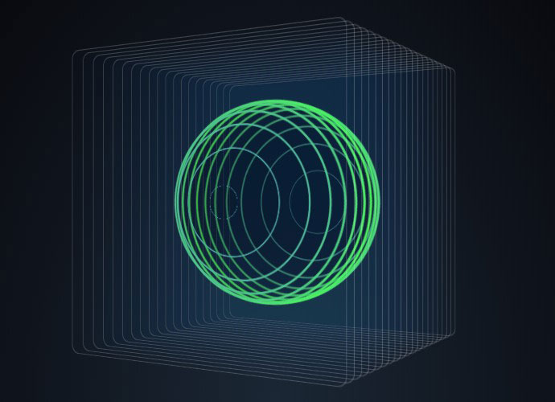

# objetivo
- Recrear y animar la siguiente imagen en Zdog.js


# Resultado final


[Pagina web](https://carloscruzvalencia.github.io/3D-sphere-square-zdog.js/)
<details open>
<summary>Documentacion del proyecto</summary>

## Generamos un grupo donde almacenar todos los cubos
```JavaScript 
let rubikCubes = new Zdog.Anchor({
    addTo: rubik

});
```

## Creamos dos listas con la pocicion del los circulos y el espacio entre ellos
```JavaScript
circ = [200,350,465,530,570,590,590,570,530,465,350,200]
space = 320
```
## Mediante un bucle se generan los circulos nesesarios
```JavaScript 
for (i = 0; i != circ.length; i++) {
    new Zdog.Ellipse({
        addTo: sphere,
        diameter: circ[i],
        stroke: 4,
        color: 'green',
    });
}
```
## Mediante unas condiciones ponemos el espacio entre los circulos
```JavaScript
    if (i <= 6) {
        sphere.children[i].translate.z = space
        space = space - 50
    }
    else {
        sphere.children[i].translate.z = space
        space = space - 50
    }
```
## Mediante un bucle se generan los cubos nesesarios
```JavaScript 
for (i= 0;i!= 40;i++){
    let rect = new Zdog.Rect({
        addTo: cube,
        width: 800,
        height: 800,
        stroke: 1.5,
        color: 'white',
        translate:{
            z: i *-17
        }
    });
}
```
## Terminamos animando todo el proyecto 
```JavaScript
function animate() {
    sphere.rotate.y += 0.01
    Fshape.updateRenderGraph();
    requestAnimationFrame(animate);
}
animate(); 
```
# Resultado final


visita la pagina web
[Pagina web](https://carloscruzvalencia.github.io/3D-sphere-square-zdog.js/)
</details>
